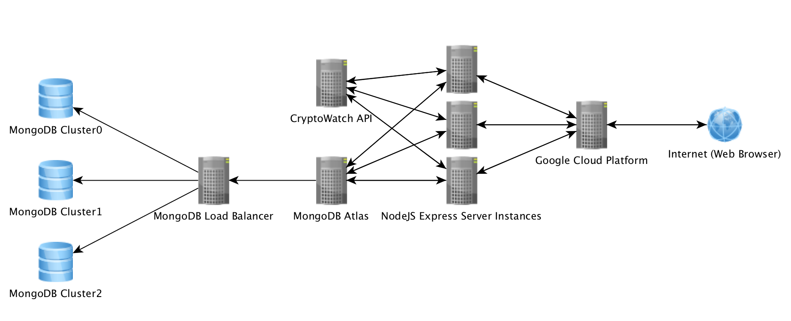
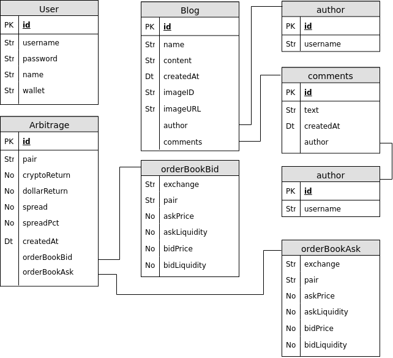
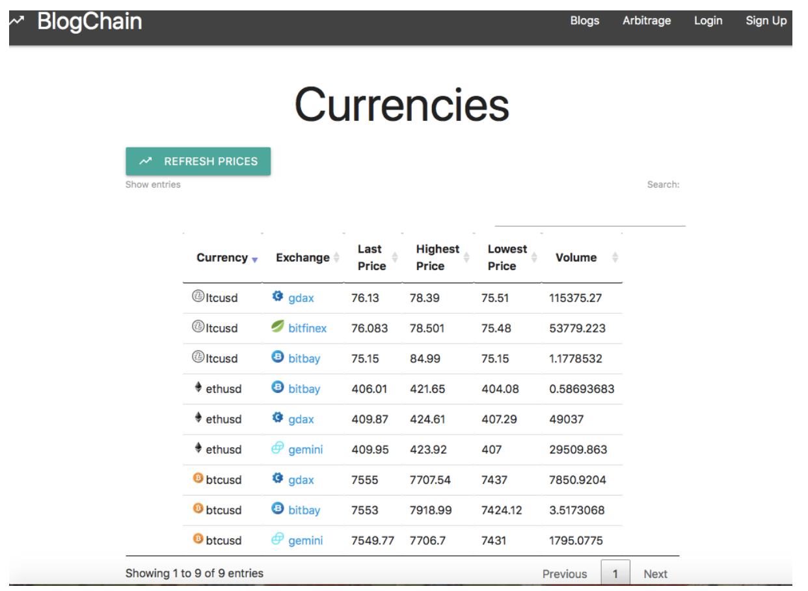
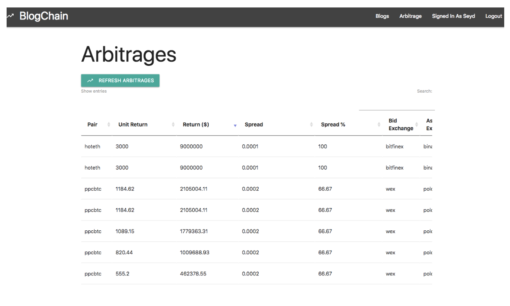
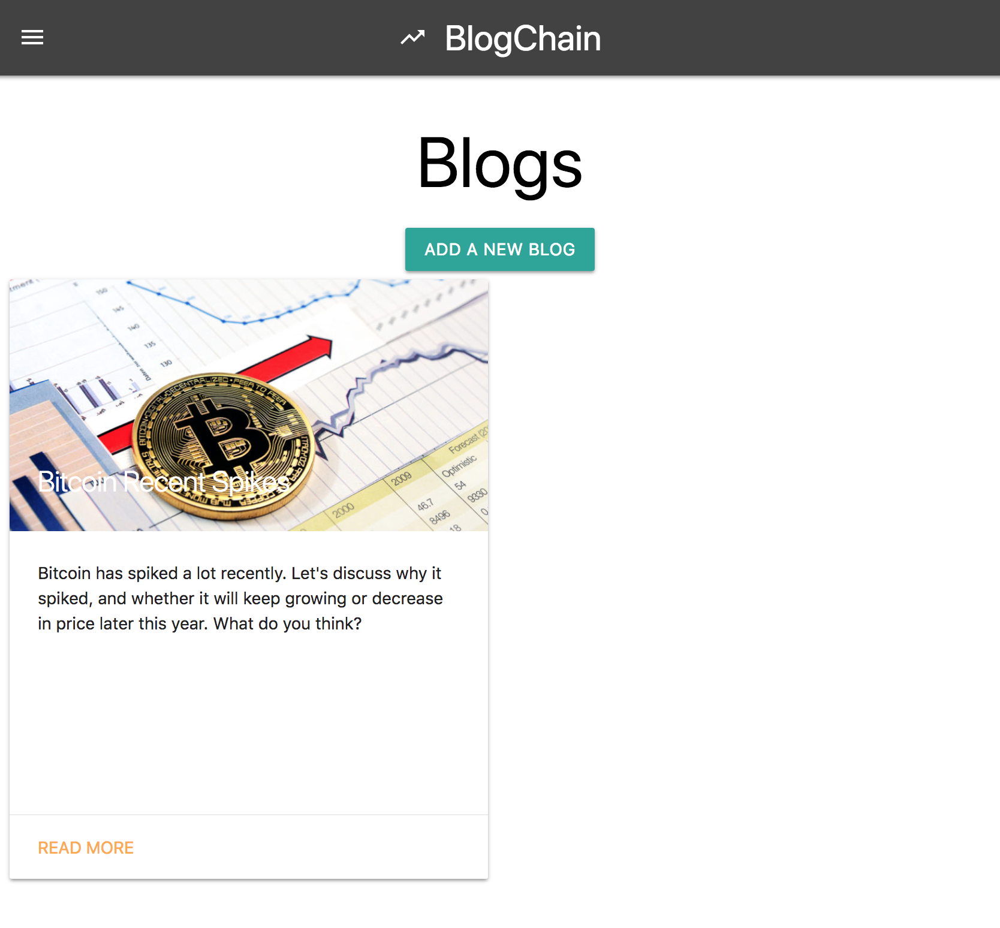

# BlogChain
Cryptocurrency forum and arbitrage opportunity application.

## URL
The app is hosted on Google Cloud Platform using App Engine: [Click Here](https://dal-cloud-s2018-fiery-caldron.appspot.com/)

## Architectural Overview

### Web-Application
The NodeJS Express web-app is hosted on GCP App Engine with 1 CPU, 6GB memory, 10GB disk space, dynamic scaling, and 
liveness checks (automatically restarting unhealthy docker containers). The application currently 
supports up to 10 instances, and auto-scaling triggers when the CPU utilization spikes above 70%.

### Database
Our NoSQL MongoDB is hosted on Google Cloud Platform (using MongoDB Atlas) with 3 clusters. GCP provides us 
with DB clustering, DB sharding, DB Request Load Balancing, and much more out of the box.

## Application Screenshots

### Dashboard

### Arbitrages

### Blogs

## Local Environment Setup
1. Run `npm install`
2. Run `npm start` or `node .` to start the server
3. Access the app locally using [HTTP](http://localhost:8080) or [HTTPS](https://localhost:8081)

## Project Dependencies
Make sure you have installed `node` and `npm`.

## GCP App Deployment
1. Make sure `gcloud` is installed locally (install the google cloud SDK and run `./install.sh`)
2. Make sure you are logged in to the BlogChain google account with gcloud.
3. Run `gcloud app deploy` to deploy the app to GCP
References: https://cloud.google.com/sdk/install
